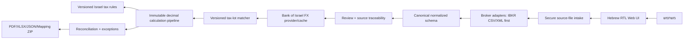
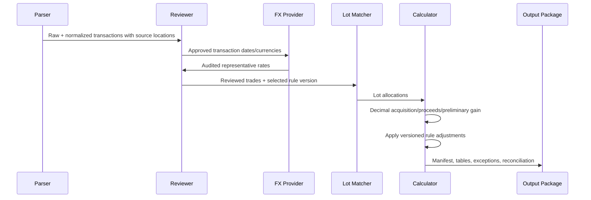

# דוח מס למשקיעים — IBKR Tax Israel: Architecture

## Scope
This repository now contains a Milestone-1/2 foundation for a Hebrew-first, RTL Israeli tax-report preparation app for Interactive Brokers. It is not an official Israel Tax Authority product and every generated result must be labeled:

**טיוטת חישוב והכנה לדיווח — נדרש אימות של רואה חשבון או יועץ מס**

## Architecture

## Canonical data schema
Core entities are specified in `src/core/schema.js` and documented here:

- `TaxProject`: tax year, residency, entity type, rule version, completeness state.
- `SourceFile`: original filename, MIME type, size, SHA-256, upload status, account ID, period.
- `SourceLocation`: immutable link to CSV row, XML node, PDF page, spreadsheet row, or OCR block.
- `RawRecord`: untouched broker values plus source location.
- `NormalizedTransaction`: stable internal ID, broker external IDs, dates, security identity, quantity, price, currency, fees, source record links, review status.
- `ExchangeRate`: requested/effective date, currency, provider, rule used, raw response hash, override flag.
- `TaxLot` and `LotAllocation`: deterministic lot inventory and sale-to-purchase allocation details.
- `CalculationStep`: immutable audit line with rule ID, inputs, output, precision, and source references.
- `ManualOverride`: previous value, new value, reason, identity, timestamp, attachment reference, review status.
- `Exception`: unsupported activity or blocking issue with severity and professional-review status.

## Calculation flow

## Audit and traceability model
Every material value stores: original source value, normalized value, source location, parser/adapter version, rule ID, calculation step ID, decimal precision, reviewer state, and any manual override chain. Original extracted values are never overwritten.

## Rule versioning format
Rules live under `tax-rules/israel/<year>/`. Each ruleset contains `rules.json`, `sources.json`, `forms-mapping.json`, and tests. Each rule has an ID, tax year, effective date, Hebrew/English description, source reference, checked date, reviewer status, professional approval flag, and change history.

## Security model
Production implementation must add authenticated users, RBAC, encrypted object storage, signed expiring downloads, CSRF protection, rate limiting, audit logs, malware scanning, temporary-file deletion, CSP, data retention controls, and AI opt-in controls. The current static foundation demonstrates UI and deterministic local calculations only.

## Assumptions and unresolved legal dependencies
- Legal tax treatment, form numbers, rates, offsets, foreign-tax-credit treatment, and exchange-rate fallback behavior must be verified for each tax year by official sources and an Israeli tax professional.
- FIFO in the demo ruleset is an explicit configurable placeholder, not a universal legal assertion.
- Generated outputs are draft support calculations only until formal approval and professional review exist.
- Bank of Israel integration is represented as an interface and audited cache shape; live provider implementation belongs in a backend milestone.
